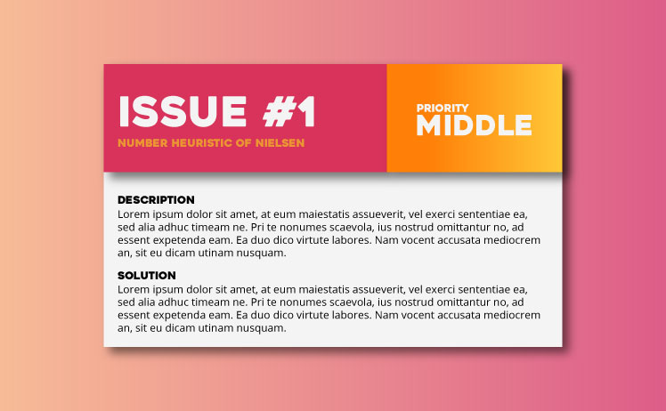

# 1. What was used?

## 1.1 Inspirations

my inspiration is based in some specific sites. I believe in a increase of workflow with time, more knowledge it's more results.

### 1.1.1 UX

In User experience my first preoccupation is with the process. I'm follow one guide (link to guide) what represent my base for developing of a application.

Let's go to the process!

#### Knowledge

First time, get the knowledge acquired whit the years and theoretic methods of UX. I'm use:

- Guide of [PrinciWeb](http://www.princiweb.com.br/blog/design/usabilidade-ux/como-uma-avaliacao-heuristica-ajuda-a-melhorar-a-usabilidade-de-um-site.html) with base book A Project Guide to [UX Design: For User Experience Designers in the Field or in the Mark](http://www.amazon.co.uk/Project-Guide-Design-Experience-Designers/dp/0321815386).
- I chose the [10 heuristics of Nielsen](https://www.nngroup.com/articles/ten-usability-heuristics/) to use on projects.

#### Apply

Analysis the project and your need. List all the processes the website and your ways, I use [Coggle](http://coggle.it) for this.

After make lists, define with client the priorities of search and focus on content. Remember, don't have project without content.

The next step, we need separate contents for importance  ranks then order heuristic, using the cards. See a example of card:

And now, planning possible tests A/B, and very important the setup of metrics the Analytics, so is possible get data for our actions.

#### Wireframes and prototypes

I believe in wireframes on process design and UX, his function on process is show the first idea about design, this not will be sent to client, only part to creation process. Currently make wireframes in paper and Adobe Photoshop, but wait Adobe Comet to make direct prototypes.

For prototypes, I use [InVision](http://www.invisionapp.com/), have all I need.

#### Tests A/B

Tests A/B is important for performance of e-commerce, but I don't dispense your use in websites, all the sites have a goal, and this goal must be achieved. With metrics, I can obtain the performance the website, and adjust items necessary. Two good tools are [vwo](https://vwo.com/) and [Google Analytics](http://analytics.google.com).

references to UX:
- [DesignBrief](http://www.designbrief.de/)
- [Simple Calculator AB](http://getdatadriven.com/ab-significance-test)
